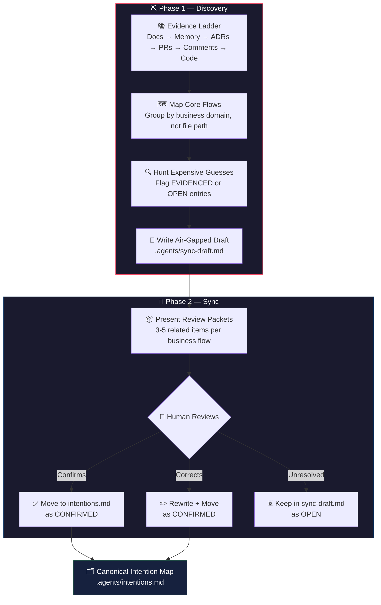

<p align="center">
  
  
  
  
</p>

<h1 align="center">🧠 RMINGI</h1>
<h3 align="center">Read My Intention, Not Guess It</h3>

<p align="center">
  <strong>An intent-alignment protocol for AI-built codebases.</strong><br/>
  Find where AI guessed the <em>WHY</em> — before the guess becomes a disaster.
</p>

---

<table>
<tr>
<td align="center">
<br/>

### 🟢 &nbsp; Using RMINGI is one sentence.

```
"Run read-my-intention on this codebase."
```

That's it. Drop the `SKILL.md` into your project.
Tell your AI agent to run it. The AI scans your codebase,
finds where intention was guessed, and asks you to confirm
what's real — before the next AI changes your system.

**No setup. No config. No dependencies. Just one command.**

<br/>
</td>
</tr>
</table>

---

> *"Blurry intention is like cancer in a codebase. It doesn't cause any visible trouble at first. But as AI models build on top of unstated assumptions, it silently metastasizes — until it becomes the deadliest problem in your system."*

---

## 🚨 The Problem: Intention Drift

When AI writes code from short instructions, it **guesses** the business intent. The code works. It ships. But the guess is recorded nowhere.

Six months and thirty AI sessions later, a new AI agent reads that code and makes a *second* guess built on top of the first. Then another AI refactors. Then another optimizes. Each layer looks correct in isolation.

Eventually, you have a codebase where **every part works, but nobody can say with confidence why it was built the way it was**.

```
Human says: "Don't permanently delete customer records."

  AI-1 builds soft-delete             ← guesses it's for UX safety
  AI-2 optimizes query performance    ← archives "deleted" rows to cold storage
  AI-3 cleans up cold storage         ← purges records older than 90 days

  Result: 3 years of legally required audit data — gone.
  Every AI was "right." Every test passed. The system is catastrophically wrong.
```

**Intention drift is the most expensive silent failure in AI-driven development.**

---

## 💀 Real-World Catastrophe Examples

These aren't hypothetical. These are the exact failure patterns that emerge when multiple AI models work on the same codebase without shared intent.

### Example 1: The Soft Delete That Destroyed an Audit Trail

| | |
|---|---|
| **Instruction** | *"Don't permanently delete customer records."* |
| **AI-1 Built** | Standard soft-delete (`deleted_at` timestamp) |
| **AI-1 Assumed** | Operational hygiene — a safety net for accidental clicks |
| **AI-2 Did** | Archived 80,000 "deleted" records to cold storage for query performance |
| **AI-3 Did** | Added a 90-day purge job on cold storage to save costs |
| **Catastrophe** | Compliance audit requested 3 years of user history. Data was gone. Massive legal exposure. |

> **How RMINGI catches it:** Flags `deleted_at` as `EVIDENCED` with `HIGH` risk (Data/Compliance) and asks:  
> *"Is this soft-delete for UI undo, or for legal retention? What is the minimum retention period?"*

---

### Example 2: The Status Field That Caused Double Charges

| | |
|---|---|
| **Instruction** | *"Add a pending status to payments."* |
| **AI-1 Built** | A `pending` state in the payment state machine |
| **AI-1 Assumed** | "Pending" means the gateway is slow — safe to auto-retry |
| **AI-2 Did** | Added a cron job to retry timed-out pending payments every 6 hours |
| **Catastrophe** | 72 hours later: duplicate charges across 2,400 accounts. Refund requests. Support fires. Revenue clawback. |

> **How RMINGI catches it:** Detects the state machine and asks:  
> *"Does `pending` resolve via webhook, or does it wait for manual accounting approval? Can it be retried automatically?"*

---

### Example 3: The "Optional" Field That Broke Identity

| | |
|---|---|
| **Instruction** | *"Add an agent code field to registration."* |
| **AI-1 Built** | Optional text field on the registration form |
| **AI-1 Assumed** | A generic identifier, like a referral code |
| **AI-2 Did** | Built a search index using `agent_code` as a unique key |
| **AI-3 Did** | Built a reporting dashboard filtered by `agent_code` |
| **Catastrophe** | 40% of users had no agent code. Reports showed phantom gaps. Search returned wrong profiles. Admin trust in the system collapsed. |

> **How RMINGI catches it:** Flags the optional field and asks:  
> *"Is this a universal identifier or a conditional link? What percentage of users will have it? Can downstream systems assume it exists?"*

---

### Example 4: The Cron Job That Deleted Paying Customers

| | |
|---|---|
| **Instruction** | *"Clean up inactive trial users after 30 days."* |
| **AI-1 Built** | A daily cron that deletes users inactive for 30+ days with `role = trial` |
| **AI-1 Assumed** | GDPR right-to-be-forgotten compliance |
| **AI-2 Did** | Refactored the query to "optimize" — removed the `role = trial` filter because "all inactive users should be cleaned" |
| **Catastrophe** | Enterprise customers on annual contracts who hadn't logged in for 2 months were deleted. Contracts voided. Data unrecoverable. |

> **How RMINGI catches it:** Flags the deletion scope and asks:  
> *"Is this cleanup for compliance, performance, or cost? Which user segments are protected? Who approved expanding the scope?"*

---

### Example 5: The Webhook That Silently Stopped Working

| | |
|---|---|
| **Instruction** | *"Integrate with Stripe for payment updates."* |
| **AI-1 Built** | Webhook endpoint receiving Stripe events, updating order status |
| **AI-1 Assumed** | Standard event handling — process and acknowledge |
| **AI-2 Did** | Added request validation middleware that rejects payloads missing a custom header |
| **AI-3 Did** | Refactored error handling to silently swallow 4xx responses to "reduce noise" |
| **Catastrophe** | Stripe webhooks started getting rejected. Orders were stuck in `processing`. No alerts fired because errors were silently swallowed. 11 days of lost payment updates before manual discovery. |

> **How RMINGI catches it:** Flags the webhook integration and asks:  
> *"Is this webhook idempotent? What happens on failure — retry, alert, or silent drop? Who monitors delivery health?"*

---

## 🔄 How RMINGI Works

RMINGI runs in two phases after a codebase has grown, or when a new AI model is about to work on it.



---

## 🎯 The 3 States

Every finding in RMINGI exists in exactly one of three states:

| State | Meaning | Who Sets It | Where It Lives |
|---|---|---|---|
| `EVIDENCED` | Strong evidence supports a likely intention, but no human has verified it | AI | `.agents/sync-draft.md` |
| `OPEN` | The intention is unclear or evidence conflicts — needs human input | AI | `.agents/sync-draft.md` |
| `CONFIRMED` | A human verified the intention — future AI can rely on it | **Human only** | `.agents/intentions.md` |

> **Rule:** Only a human can move an entry to `CONFIRMED`. No amount of AI confidence is sufficient.

---

## 📚 The Evidence Ladder

Before guessing intention from code, RMINGI requires the AI to exhaust higher-trust sources first:

| Priority | Source | Trust Level |
|---|---|---|
| 1 | `README.md` and project documentation | Highest |
| 2 | `.agents/` memory files (intentions, context) | High |
| 3 | ADRs, product notes, migration docs, runbooks | High |
| 4 | PRs, issues, and commit messages | Medium |
| 5 | Prompts, handoff notes, and inline comments | Medium |
| 6 | The code itself | Lowest |

### Conflicting Evidence Protocol

When sources disagree — e.g., README says one thing, code does another:

1. **Log each source** with its claim in the draft as `OPEN`
2. **Surface the conflict explicitly** for human review
3. **Never silently pick a winner** — contradictions are the most dangerous intention gaps
4. **Note the gap** — if a layer doesn't exist or is inaccessible, record that absence as context

---

## 📊 What Makes a Guess "Expensive"?

Not every assumption needs review. RMINGI focuses only where being wrong is costly:

| If Being Wrong Could Cause... | Risk Level | Action |
|---|---|---|
| Data loss or corruption | 🔴 **CRITICAL** | Always flag |
| Financial error (double charge, lost revenue) | 🔴 **CRITICAL** | Always flag |
| Security breach or access escalation | 🔴 **CRITICAL** | Always flag |
| Compliance or legal violation | 🔴 **CRITICAL** | Always flag |
| Broken integration or silent data loss | 🟠 **HIGH** | Flag |
| Degraded UX or broken user flow | 🟡 **MEDIUM** | Flag if scope is wide |
| Cosmetic mismatch | ⚪ **LOW** | Ignore |

**Heuristic:** If the code touches **money, identity, deletion, external systems, or legal rules** — it qualifies. If it's a button color or label, it doesn't.

---

## 📊 Approach Comparison

| Approach | Primary Question | Blind Spot |
|---|---|---|
| **Spec-Driven** | Did the AI build what I described? | *Why* it was described that way |
| **Harness Engineering** | Did the AI build it consistently? | Whether it was the *right* thing to build |
| **RMINGI** | **Does the AI know WHY this exists?** | — |

> Specs and harnesses control the **WHAT** and constrain the **HOW**.  
> RMINGI aligns the **WHY**.  
> A builder with perfect blueprints and perfect guardrails will still build the wrong house if they misunderstand what the family needs it *for*.

---

## ⏱️ When To Run RMINGI

| Trigger | Action |
|---|---|
| Project is 6+ months old | Full initial sync on the whole codebase |
| Switching AI models | Run discovery to orient the new model |
| Planning a major refactor | Require AI to read affected `intentions.md` areas first |
| A `CONFIRMED` intention is >12 months old | Trigger a mini-sync to verify it still holds |
| Current behavior contradicts the recorded intention | Trigger an immediate re-sync |
| A human says "that's not why we built it" | Trigger an immediate re-sync |

---

## 📁 Repo Structure

```
skill-read-my-intention/
├── README.md              ← You are here
├── SKILL.md               ← The executable skill for AI agents
├── CHANGELOG.md           ← Version history and migration notes
├── LICENSE                 ← MIT License
├── templates/
│   ├── intentions.md      ← Template for the canonical intention map
│   └── sync-draft.md      ← Template for the air-gapped review draft
└── examples/
    └── payment-flow/      ← Worked example: RMINGI scanning a payment system
        ├── before.md       ← The codebase state before RMINGI
        ├── sync-draft.md   ← What the AI draft looks like
        └── after.md        ← The confirmed intention map after human sync
```

---

## 🚀 Usage

**As a standalone skill:**
```
1. Copy SKILL.md into your project where your AI agent can read it
2. Say: "Run read-my-intention on this codebase"
3. The AI produces the air-gapped draft and begins the Batched Sync with you
```

**As part of the [AI-First Maintenance Bundle](https://github.com/Zhihong0321/skill-ai-first):**
- RMINGI is invoked when intention drift is suspected
- Output feeds into `context-navigator` and constrains architectural decisions

---

## 🔖 Version History

| Version | Author | Key Change |
|---|---|---|
| v0.1 | Claude Sonnet 4.6 | Core concept. CLEAR/GUESSED taxonomy. Discovery + Sync phases. |
| v0.2 | Gemini 3.1 Pro | Air-gapped drafts. Evidence Ladder. Batched Sync. Minesweeper approach. |
| v0.3 | GPT 5.4 Pro | Simplified to 3 states (EVIDENCED/OPEN/CONFIRMED). Tighter prose. |
| **v0.4** | **Claude Opus 4.6 (Thinking)** | **Restored catastrophe examples. Conflict resolution. Heuristics. Structured templates. Worked example. Repo professionalization.** |

See [CHANGELOG.md](CHANGELOG.md) for full migration notes.

---

<p align="center">
  <strong>RMINGI</strong> — <em>Read My Intention, Not Guess It</em><br/><br/>
  Code changes. Specs age. Architecture evolves.<br/>
  Layer upon layer of AI assumption is added to the stack.<br/>
  But <strong>why a feature exists</strong> — the core business intention — is absolute.<br/><br/>
  RMINGI exists to make sure the AI is reading that intention, not guessing it.
</p>
